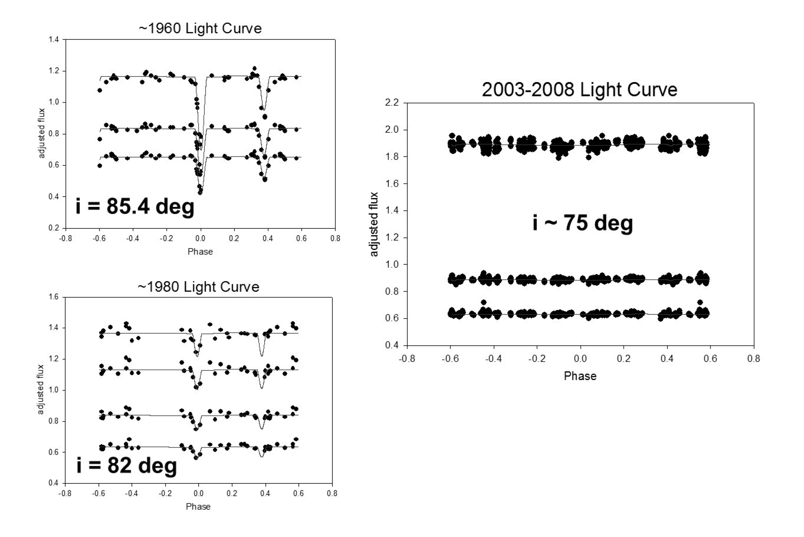
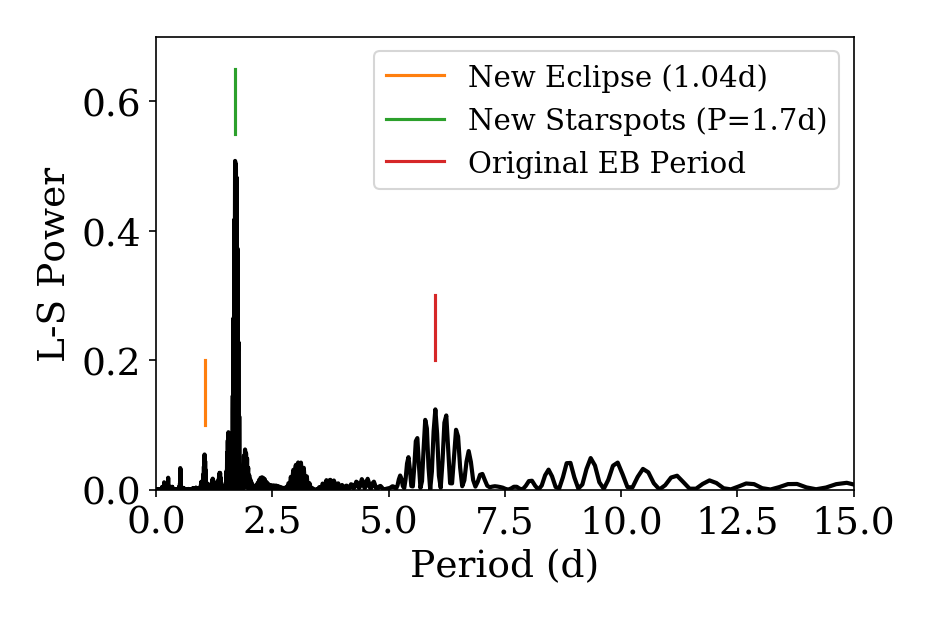

# QX-Cas

[Simbad](http://simbad.u-strasbg.fr/simbad/sim-basic?Ident=QX+Cas)

## The disappearing EB

[AAS 2009](https://ui.adsabs.harvard.edu/abs/2009AAS...21343216B/abstract), observations that EB is no longer eclipsing!

[JAAVSO Review 2012](https://www.aavso.org/apps/jaavso/article/2834/), on EBs, featuring summary of QX Cas

*Figure 2 from the JAAVSO review*

## But wait...
TESS Sector 18 (and now Sector 24) saw *three* periods!

